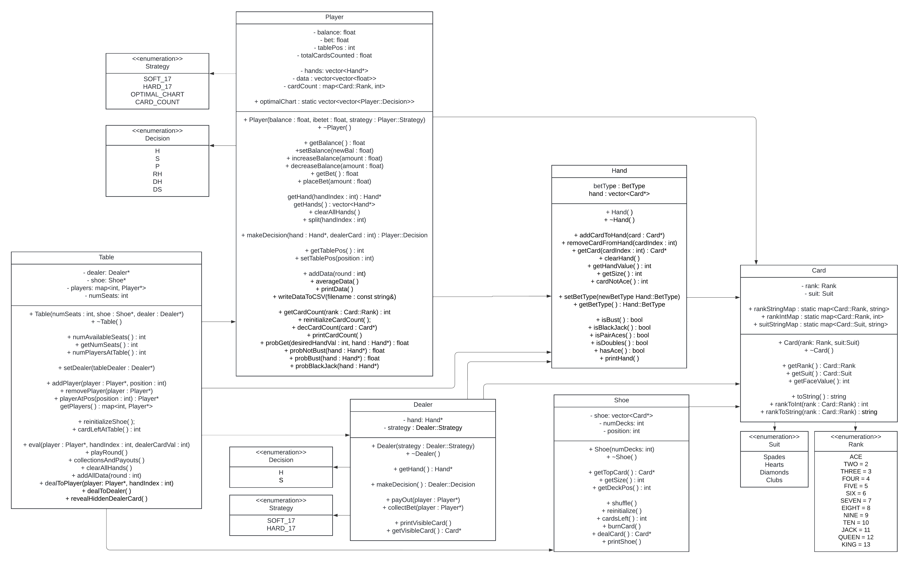
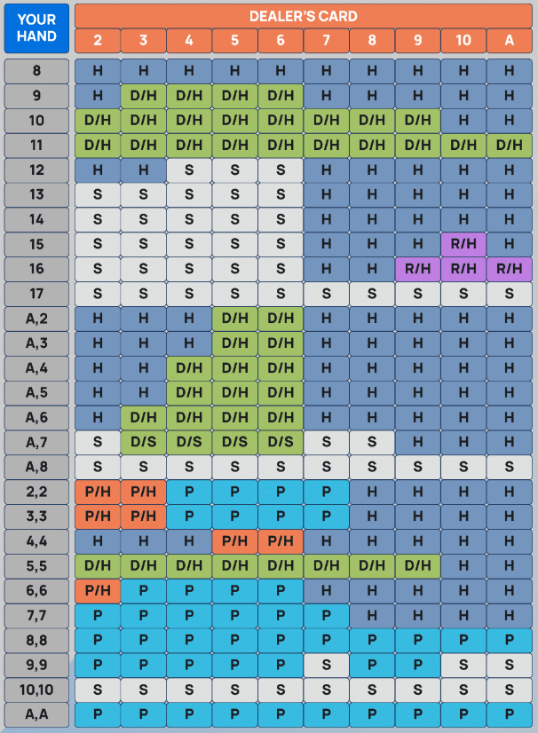
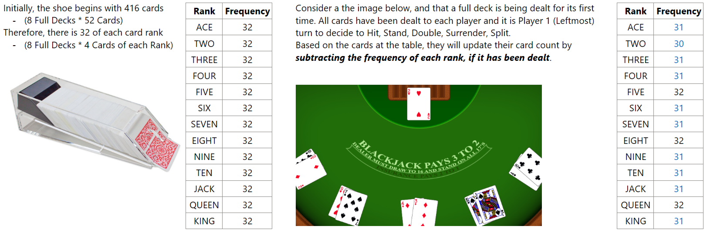
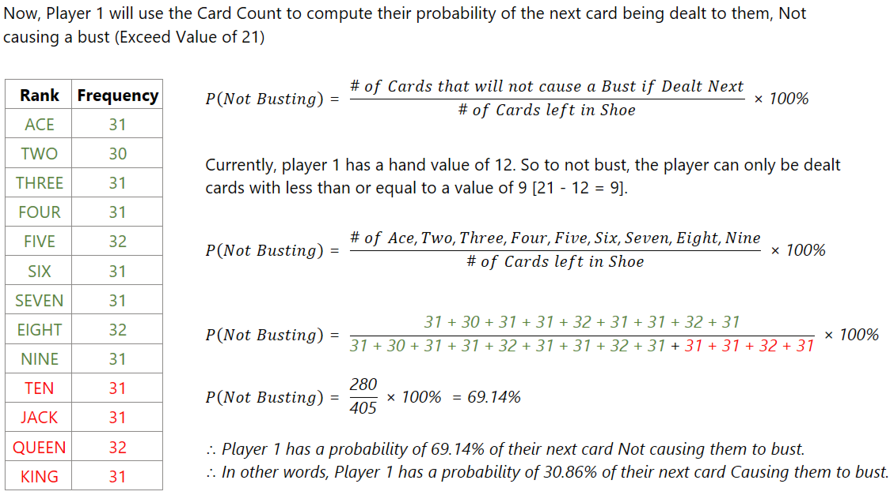
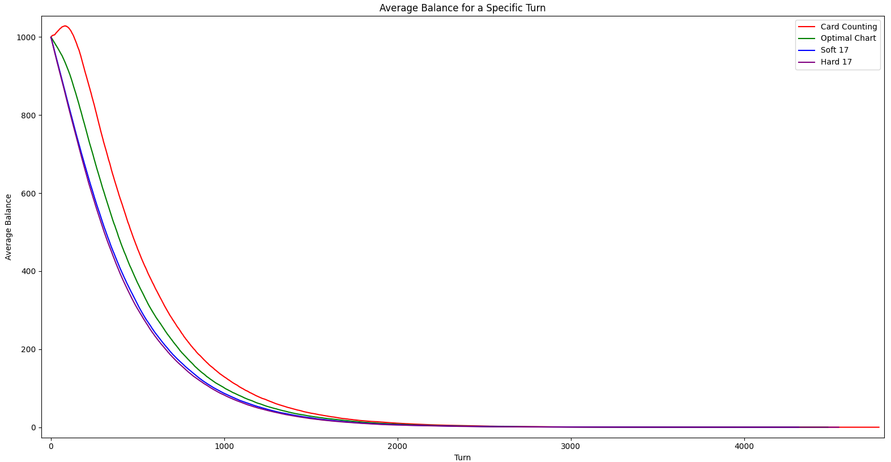
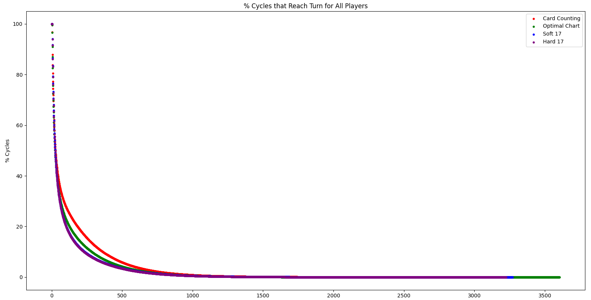
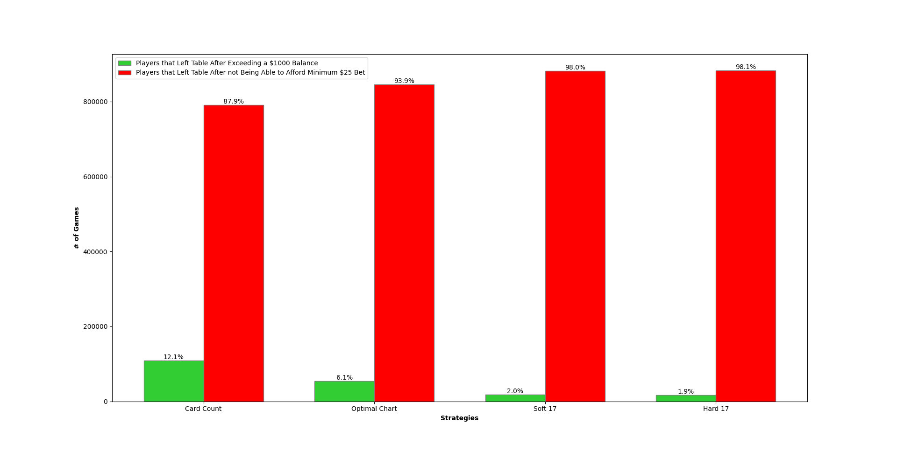

# Blackjack Simulator
## Overview
This project is a simulation of the popular casino card game, Blackjack. It’s purpose is to simulate players using different strategies, including my own card counting probability technique, and compare the player performance. 

Each `player` starts the game with a balance of `$100`, betting `$25` each round, and leaves the table if they *either* reach a balance of `$1,000` or can no longer afford the minimum bet of `$25`.

## Features
- Simulates a game of Blackjack with up to 5 players and a dealer.
- Tracks each player's balance and bet amount.
- Uses a shoe of 8 decks, with an option to reinitialize and shuffle the shoe when the number of cards left falls below a certain point.
- Supports various player strategies including `HARD_17`, `SOFT_17`, `OPTIMAL_CHART`, `CARD_COUNTING`.
- Allows players to make decisions such as 
    `H = HIT`
    `S = STAND`
    `P = SPLIT`
    `DS = DOUBLE IF ALLOWED, OTHERWISE STAND`
    `DH = DOUBLE IF ALLOWED, OTHERWISE HIT`
    `RH = SURRENDER IF ALLOWED OTHERWISE HIT`

## Classes
- `Card`: Represents a playing card.
- `Hand`: Represents a hand of cards held by a player or the dealer.
- `Shoe`: Represents a shoe of cards to be dealt.
- `Player`: Represents a player in the game, with methods for making decisions based on a strategy.
- `Dealer`: Represents the dealer in the game.
- `Table`: Represents the blackjack table, with methods for playing rounds, handling bets, and managing players.
## UML Diagram

## Strategies
- `HARD_17`: Player stands on a hand value of 17+, otherwise the player hits.
- `SOFT_17`: Player stands on a hand value of 17+. However, if their hand has a value of 17 with an Ace in it, they hit. For all hand values less than 17, the player hits.
- `OPTIMAL_CHART`: Renowned Chart derived by mathematicians, often provided by casino’s themselves that maps any combination of player cards and/or hand value, with the dealer’s visible card, to an Optimal Decision. 

  

- `CARD_COUNTING`: Player keeps track of all the possible cards left in the shoe, and decides on whether to Hit, Stand, Double or Surrender, based on the probability of their next dealt card causing them to bust.

  
  

Now, what does a player do with this probability? They will use it, along with a threshold to make a final decision on what action to do next. 
In simpler terms, if a player thinks their probability to bust in their next dealt card is too high, then they will `STAND`. This means you’re choosing safety over the chart’s suggestion because the risk of busting is too high. Vice versa, if a player thinks their probability to bust in their next dealt card is low enough, then they will `HIT`. This means you’re choosing to take a risk over the chart’s suggestion because the chance of improving your hand is good.

**In simple terms, these thresholds help you balance the risk and reward of each decision, allowing you to make the most statistically advantageous move in each situation.**

### How do we find these Thresholds? 
In each simulation, a player goes through 250,000 games, making decisions based on a fixed threshold. This process is repeated with various thresholds ranging from 0.01 to 0.99 in increments of 0.01.

For every possible hand value a player can have (from 2 to 21), a unique threshold is used for decision-making. For instance, a player with a hand value of 12 has a lower chance of busting than a player with a hand value of 19, so they use different thresholds to evaluate their situation.

Each combination of threshold and hand value is simulated and analyzed separately to prevent any interference between different thresholds.

After all simulations are completed, the average balance of a player at each turn over the 250,000 games is calculated for each threshold. The threshold that results in the highest average earnings over time is selected as the optimal threshold. This approach aims to maximize the player’s earnings in the long run.

## Analysis & Metrics
### Average Balance for a Specific Turn
On this graph, the horizontal axis (x-axis) represents the turn number in a game, and the vertical axis (y-axis) represents the average balance of a player at that turn.

For example, if you see a point at (40, 500) on the graph, it means that on average, players had a balance of $500 at turn 40. This average is calculated from all games that reached turn 40. If a game did not reach turn 40, it is counted as zero in the average.

As you move along the x-axis from left to right (from earlier turns to later turns), you might see the average balance increase or decrease, depending on the strategies used by the players.

A strategy that results in a higher average balance at each turn is generally better, as it means the player is more likely to have more money at that point in the game. So, if one strategy results in a higher line on the graph than another strategy, it means that the first strategy is typically more successful in terms of the player’s balance

Evidently, the **Card Counting Strategy** is the ony strategy that has a ***positive average balance after the first turn***. This means that on average, players won money on their first turn (***Very Minimal Winnings***) while players of other strategies lost money on average. Regardless, Card Counting is undoubetdly the best strategy of the four.

### % of Games that Reached Specific Turn
On this graph, the horizontal axis (x-axis) represents the number of turns in a game, and the vertical axis (y-axis) represents the percentage of games that reached that number of turns.

For example, if you see a point at (50, 60%) on the graph, it means that in 60% of the games, or 600,000 out of 1,000,000 simulations, the game reached at least 50 turns.

As you move along the x-axis from left to right (from fewer turns to more turns), the percentage on the y-axis typically decreases. This is because fewer games reach a high number of turns.

In this case, **Card Counting Strategy** has the ***highest % of Games in the later turns***, meaning the strategy lasted more rounds than the other four.

### Final Balance as Way of Exit
Recall that a player begins with an initial balance of `$100` and stops playing when they have either have a balance of `$1,000` or not enough to afford the minimum `$25` bet.

For 1,000,000 simulations for each strategy, this is how many games ended with a balance of `$1,000` and how many ended without being able to afford the minimum `$25` bet.

Clearly, Card Counting had more players reach $1,000 (12.1%) than any other strategy, proving that it is the best of the four strategies.

## Future Improvements
- Add more Player Strategies.
- Implement a Graphical User Interface for Visualization.
- Allow for Custom User Input.